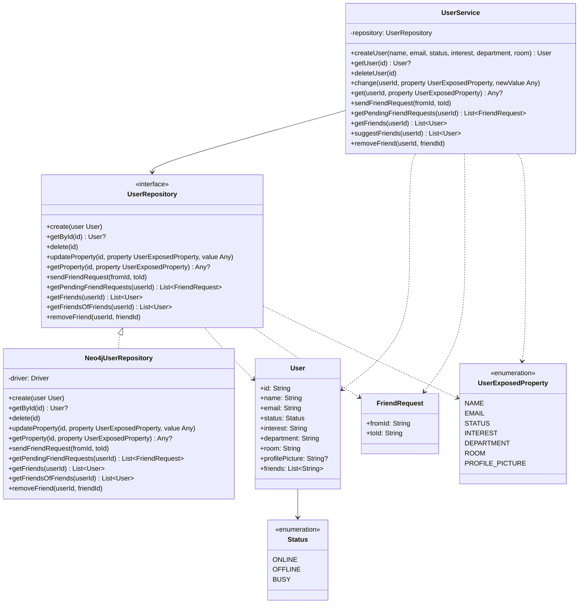

# UserService Extended Design

Date: 2026-05-07

## Overview

Extend the UserService to enforce proper encapsulation: system-assigned IDs, typed property access, and a friend-request system that auto-resolves to friendship on mutual send.

## Goals

- `createUser` generates ID internally; callers cannot assign IDs
- Property updates and reads go through typed, validated methods (`change`/`get`)
- Friendship is initiated only via friend requests; mutual send auto-creates the friendship
- Users can query their pending incoming friend requests

## New Models

### `FriendRequest`

```kotlin
data class FriendRequest(
    val fromId: String,
    val toId: String
)
```

Only PENDING requests are persisted. Resolved requests are deleted.

### `UserExposedProperty`

```kotlin
enum class UserExposedProperty {
    NAME, EMAIL, STATUS, INTEREST, DEPARTMENT, ROOM, PROFILE_PICTURE
}
```

Used by `change` and `get` to enforce valid property names at compile time.

## UserService API

### Creation

```kotlin
fun createUser(
    name: String,
    email: String,
    status: Status,
    interest: String,
    department: String,
    room: String
): User
```

Generates UUID internally. `profilePicture` defaults to null; set after creation via `change`.

### Property Access

```kotlin
fun change(userId: String, property: UserExposedProperty, newValue: Any)
fun get(userId: String, property: UserExposedProperty): Any?
```

- Property name validated at compile time via enum.
- `newValue` type checked at runtime against expected type for the property.
- Throws `IllegalArgumentException` if type mismatch.

### Friend Requests

```kotlin
fun sendFriendRequest(fromId: String, toId: String)
fun getPendingFriendRequests(userId: String): List<FriendRequest>
```

`sendFriendRequest`: if a reverse pending request exists (toId → fromId), both are resolved and a friendship is created automatically. Otherwise a PENDING request is stored.

`getPendingFriendRequests`: returns all requests sent TO `userId` that are still pending.

### Retained Methods

```kotlin
fun getUser(id: String): User?
fun deleteUser(id: String)
fun getFriends(userId: String): List<User>
fun suggestFriends(userId: String): List<User>
fun removeFriend(userId: String, friendId: String)
```

### Removed Methods

| Removed | Replacement |
|---------|-------------|
| `createUser(user: User)` | `createUser(name, email, status, interest, department, room)` |
| `updateUser(user: User)` | `change(userId, property, newValue)` |
| `addFriend(userId, friendId)` | `sendFriendRequest(fromId, toId)` |

## UserRepository Interface

### Changed signatures

```kotlin
// ID generation handled in service; repo receives complete User
fun create(user: User)

// Replaces update(user: User)
fun updateProperty(id: String, property: UserExposedProperty, value: Any)
fun getProperty(id: String, property: UserExposedProperty): Any?

// Replaces addFriend
fun sendFriendRequest(fromId: String, toId: String)
fun getPendingFriendRequests(userId: String): List<FriendRequest>
```

### Retained

```kotlin
fun getById(id: String): User?
fun delete(id: String)
fun getFriends(userId: String): List<User>
fun getFriendsOfFriends(userId: String): List<User>
fun removeFriend(userId: String, friendId: String)
```

## Neo4j Implementation

### Graph Model

```
(:User)-[:FRIENDS_WITH]-(:User)   // existing, bidirectional
(:User)-[:SENT_REQUEST]->(:User)  // new, directed
```

### `sendFriendRequest` — Atomic Cypher

```cypher
MATCH (from:User {id: $fromId}), (to:User {id: $toId})
OPTIONAL MATCH (to)-[reverse:SENT_REQUEST]->(from)
WITH from, to, reverse, reverse IS NOT NULL AS isMutual
CALL {
  WITH from, to, reverse, isMutual
  WITH from, to, reverse WHERE isMutual
  DELETE reverse
  MERGE (from)-[:FRIENDS_WITH]-(to)
}
CALL {
  WITH from, to, isMutual
  WITH from, to WHERE NOT isMutual
  MERGE (from)-[:SENT_REQUEST]->(to)
}
RETURN isMutual
```

Single transaction — no race condition.

### `getPendingFriendRequests`

```cypher
MATCH (from:User)-[:SENT_REQUEST]->(to:User {id: $userId})
RETURN from.id AS fromId, to.id AS toId
```

### `updateProperty` / `getProperty`

Cypher uses a dynamic property key via `SET n[$property] = $value` / `RETURN n[$property]`, where `property` is the camelCase Neo4j field name mapped from `UserExposedProperty` (e.g. `PROFILE_PICTURE` → `"profilePicture"`).

## UML Diagram



## File Structure

```
core/src/main/kotlin/
├── model/
│   ├── User.kt                   (unchanged)
│   ├── Status.kt                 (unchanged)
│   ├── FriendRequest.kt          (new)
│   └── UserExposedProperty.kt    (new)
├── service/
│   └── UserService.kt            (rewritten)
└── repository/
    └── UserRepository.kt         (updated)

neo4j-impl/src/main/kotlin/
└── repository/
    └── Neo4jUserRepository.kt    (updated)

core/src/test/kotlin/
└── service/
    └── UserServiceTest.kt        (updated)

neo4j-impl/src/test/kotlin/
└── repository/
    └── Neo4jUserRepositoryIT.kt  (updated)
```
